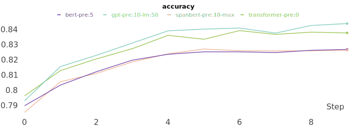

# transformer-evolution
Transformer 이후 나온 Pretrained Language Model을 이해하기 위해서 간단하게 구현 하였습니다.

## 환경
* Python(=3.6)

```sh
$ pip install torch
$ pip install pandas
$ pip install tqdm
$ pip install wget
$ pip install sentencepiece
$ pip install wandb
```


## train data 준비
- [Naver Movie](https://movie.naver.com/movie/point/af/list.nhn) 데이터를 사용 했습니다.
```sh
$ python common_data.py --mode download
```
- data 폴더 아래 'ratings_test.txt', 'ratings_train.txt' 두개의 파일을 다운로드 합니다.


## pretrain data 준비
- [web-crawler](https://github.com/paul-hyun/web-crawler)를 이용하세요.
```sh
$ git clone https://github.com/paul-hyun/web-crawler.git
$ cd web-crawler
$ python kowiki.py
```
- 다운로드 된 kowiki_yyyymmdd.csv 파일을 <transformer-evolution-home>/data/kowiki.csv로 복사해 주세요.


## vocab 생성
- kowiki 데이터를 sentencepiece를 이용해서 생성 합니다.
- vocab size는 8,000개 입니다.
```sh
$ python vocab.py
```
- 'kowiki.model', 'kowiki.vocab' vocab 관련한 두개의 파일을 생성 합니다.


## data 생성
- pretrain 및 train data를 모델에서 사용하기 좋은 형태로 미리 만들어 놓습니다.
- 세부 처리는 각 모델에서 필요에 따라 처리 합니다.
```sh
$ python common_data.py --mode prepare
```
- data 폴더 아래 'kowiki.json' 파일이 생성 됩니다.


## 기타
- 사용하는 GPU 자원의 한계로 config 설정은 hidden 및 관련 parameter 1/2로 줄여서 테스트 했습니다. (config_half.json)
- GPU 자원이 충분한 경우 config.json을 사용하면 됩니다.


## 모델
#### [Transformer](https://github.com/paul-hyun/transformer-evolution/tree/master/transformer)
- 기본이 되는 Transformer 모델 입니다.
- 논문은 [Attention Is All You Need](https://arxiv.org/abs/1706.03762)를 참고 하세요.

#### [GPT](https://github.com/paul-hyun/transformer-evolution/tree/master/gpt)
- GPT 모델 입니다.
- 논문은 [Improving Language Understanding
by Generative Pre-Training](https://s3-us-west-2.amazonaws.com/openai-assets/research-covers/language-unsupervised/language_understanding_paper.pdf)를 참고 하세요.

#### [BERT](https://github.com/paul-hyun/transformer-evolution/tree/master/bert)
- BERT 모델 입니다.
- 논문은 [BERT: Pre-training of Deep Bidirectional Transformers for Language Understanding](https://arxiv.org/abs/1810.04805)를 참고 하세요.


## 결과
| ITEM                | Pretrain | epoch  | loss  | accuracy |
|---------------------|----------|--------|-------|----------|
| transformer-pre:0   | 0        | 18     | 0.303 | 0.832    |
| gpt-pre:60-lm:0     | 60       | 16     | 0.322 | 0.837    |
| bert-pre:60         | 60       | 19     | 0.349 | 0.818   |


#### loss


#### accuracy


자세한 내용은 아래를 참고 하세요.
- https://app.wandb.ai/cchyun/transformer-evolution


## 참고
- https://github.com/graykode/nlp-tutorial
- https://github.com/jadore801120/attention-is-all-you-need-pytorch
- https://github.com/JayParks/transformer
- https://github.com/huggingface/transformers

