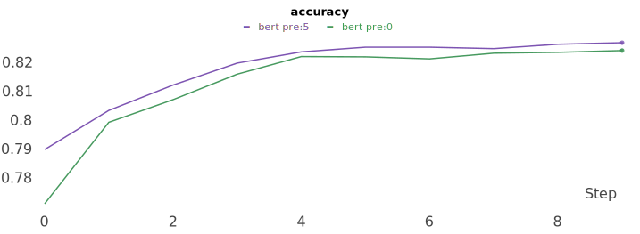

# BERT(Bidirectional Encoder Representations from Transformers)
BERT 구현 입니다.


## pretrain data
pretrain을 위한 데이터를 만드는 과정 입니다.

아래 명령을 실행하면 됩니다.

```sh
$ python data.py
```
- input: 입력 파일 입니다.. (기본 값: ../data/kowiki.json)
- output: 저장 파일 입니다. (기본 값: ../data/kowiki_bert.json)
- n_seq: 최대 token 길이 입니다. (기본 값: 512)
- vocab: 사용할 vocab 파일 입니다. (기본 값: ../kowiki.model)
- mask_prob: mask 확률 입니다. 입니다. (기본 값: 0.15)


## pretrain
pretrain 학습을 하는 과정 입니다.

아래 명령을 실행 하시면 됩니다.

```sh
$ python pretrain.py
```
- config: 설정 파일을 선택 합니다. (기본 값: config_half.json) 큰 파라미터를 사용하려면 config.json으로 변경 하세요.
- vocab: 사용할 vocab 파일 입니다. (기본 값: ../kowiki.model)
- input: 학습 데이터 파일 입니다. (기본 값: ../data/kowiki_gpt.json)
- save: 모델을 저장할 위치 입니다. (기본 값: save_pretrain.pth)
- epoch: 학습 epoch 입니다. (기본 값: 3)
- batch: 학습 batch_size 입니다. (기본 값: 28)
- gpu: 학습을 실행할 GPU 입니다. (기본 값: None) 특정 GPU에서만 동작하길 원하는 경우는 0, 1 과 같이 GPU ID를 지정해 주면 됩니다.
- seed: 랜덤 seed 입니다. (기본 값: 42)


## train
네이버 영화 데이터를 학습을 하는 과정 입니다.

아래 명령을 실행 하시면 됩니다.

```sh
$ python train.py
```
주요 옵션은 다음과 같습니다.
- config: 설정 파일을 선택 합니다. (기본 값: config_half.json) 큰 파라미터를 사용하려면 config.json으로 변경 하세요.
- vocab: 사용할 vocab 파일 입니다. (기본 값: ../kowiki.model)
- train: train 데이터 파일 입니다. (기본 값: ../data/ratings_train.json)
- test: test 데이터 파일 입니다. (기본 값: ../data/ratings_test.json)
- save: 모델을 저장할 위치 입니다. (기본 값: save_best.pth)
- pretrain: pretrain 된 모델 위치 입니다. (기본 값: save_pretrain.pth)
- epoch: 학습 epoch 입니다. (기본 값: 10)
- batch: 학습 batch_size 입니다. (기본 값: 128)
- gpu: 학습을 실행할 GPU 입니다. (기본 값: None) 특정 GPU에서만 동작하길 원하는 경우는 0, 1 과 같이 GPU ID를 지정해 주면 됩니다.
- seed: 랜덤 seed 입니다. (기본 값: 42)


## 결과

- pretrain 60회 후 학습한 경우가 가장 좋은 결과를 냈습니다. (bert-pre:60)
- pretrain 횟수가 많아 질 수록 좋은 성능을 냈습니다.
- 더 많은 데이터를 더 많은 회수를 학습하면 더 좋은 결과를 낼 것으로 예상 됩니다.

| ITEM        | Pretrain | epoch  | loss   | accuracy |
|-------------|----------|--------|--------|----------|
| bert-pre:0  | 0        | 19     | 0.364  | 0.8134   |
| bert-pre:20 | 20       | 18     | 0.3532 | 0.8159   |
| bert-pre:40 | 40       | 19     | 0.3535 | 0.8161   |
| bert-pre:60 | 60       | 19     | 0.3488 | 0.8179   |

#### loss


#### accuracy


