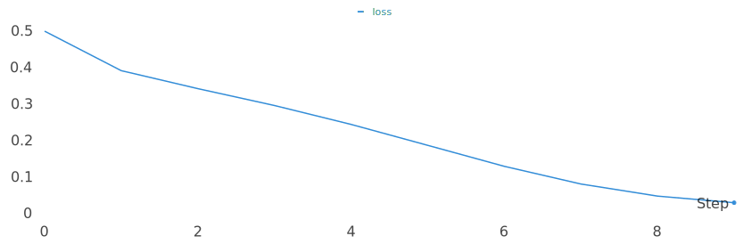
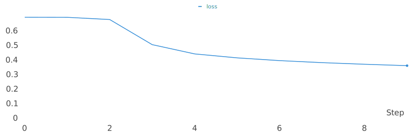
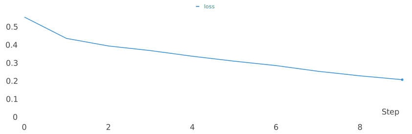
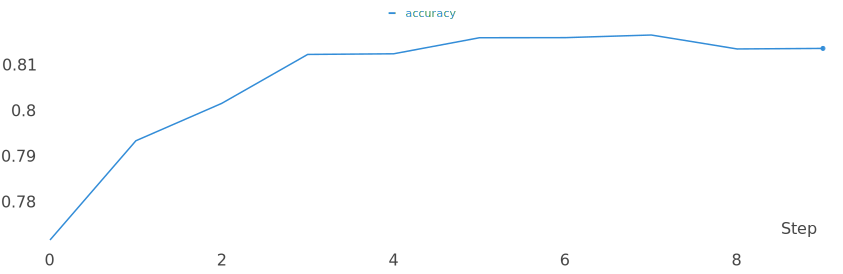

# GPT(Generative Pre-Training)
GPT 구현 입니다.


## pretrain
아래 명령을 실행 하시면 됩니다.
```sh
$ python pretrain.py
```
- config: 설정 파일을 선택 합니다. (기본 값: config_half.json) 큰 파라미터를 사용하려면 config.json으로 변경 하세요.
- vocab: 사용할 vocab 파일 입니다. (기본 값: ../kowiki.model)
- save: 모델을 저장할 위치 입니다. (기본 값: save_pretrain.pth)
- epoch: 학습 epoch 입니다. (기본 값: 3)
- batch: 학습 batch_size 입니다. (기본 값: 128)
- cuda: 학습을 실행할 GPU 입니다. (기본 값: cuda) 특정 GPU에서만 동작하길 원하는 경우는 cuda:0, cuda:1 과 같이 GPU를 지정해 주면 됩니다.
- seed: 랜덤 seed 입니다. (기본 값: 42)


## train
아래 명령을 실행 하시면 됩니다.
```sh
$ python train.py
```
주요 옵션은 다음과 같습니다.
- config: 설정 파일을 선택 합니다. (기본 값: config_half.json) 큰 파라미터를 사용하려면 config.json으로 변경 하세요.
- lm: lm을 학습할 비율 입니다. (기본 값: 0.5) lm을 학습하기 원하지 않으면 0을 주면 됩니다.
- vocab: 사용할 vocab 파일 입니다. (기본 값: ../kowiki.model)
- save: 모델을 저장할 위치 입니다. (기본 값: save_best.pth)
- epoch: 학습 epoch 입니다. (기본 값: 10)
- batch: 학습 batch_size 입니다. (기본 값: 128)
- cuda: 학습을 실행할 GPU 입니다. (기본 값: cuda) 특정 GPU에서만 동작하길 원하는 경우는 cuda:0, cuda:1 과 같이 GPU를 지정해 주면 됩니다.
- seed: 랜덤 seed 입니다. (기본 값: 42)


## 결과

### no pretrain / no lanague model
학습이 진행되면서 epoch 3이 최고 점수를 내었고 이후 epoch 부터는 학습을 할 수록 점수가 떨어 짐
- epoch: 3
- loss: 0.297

- accuracy: 0.821


### no pretrain / lanague model
학습이 진행되면서 꾸준하게 성능이 좋아짐 학습 데이터가 많고 epoch를 충분히 늘려 주면 더 좋은 결과를 낼것으로 예상 됨
- epoch: 9
- loss: 0.361

- accuracy: 0.807


### 5 epoch pretrain / no lanague model
Pretrain안할 때 보다 학습은 안정적이 되었으나 성능은 오히려 떨어짐. 테스트를 위해서 작은 네크워크를 사용했고 Pretrain이 충분하지 않았던 것으로 판단됨
- epoch: 7
- loss: 0.255

- accuracy: 0.816


### 5 epoch pretrain / lanague model
Pretrain을 더 하고, 학습 epoch도 늘려주면 더 좋은 성능을 낼 것으로 기대 됨
- epoch: 9
- loss: 0.31

- accuracy: 0.813

