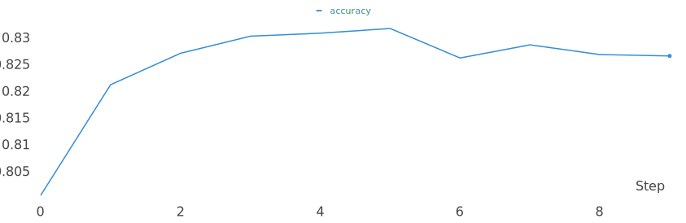

# Transformer
Transformer 구현 입니다.


## train
아래 명령을 실행 하시면 됩니다.
```sh
$ python train.py
```
주요 옵션은 다음과 같습니다.
- config: 설정 파일을 선택 합니다. (기본 값: config_half.json) 큰 파라미터를 사용하려면 config.json으로 변경 하세요.
- vocab: 사용할 vocab 파일 입니다. (기본 값: ../kowiki.model)
- save: 모델을 저장할 위치 입니다. (기본 값: save_best.pth)
- epoch: 학습 epoch 입니다. (기본 값: 10)
- batch: 학습 batch_size 입니다. (기본 값: 256) 멀티 GPU를 사용하는 경우는 batch * GPU개수로 동작 합니다.
- cuda: 학습을 실행할 GPU 입니다. (기본 값: cuda) 특정 GPU에서만 동작하길 원하는 경우는 cuda:0, cuda:1 과 같이 GPU를 지정해 주면 됩니다.
- seed: 랜덤 seed 입니다. (기본 값: 42)


## 결과
학습이 진행되면서 6 epoch부터는 overfit 되는 현상을 보였습니다.

- epoch: 5
- loss: 0.299

- accuracy: 0.832


